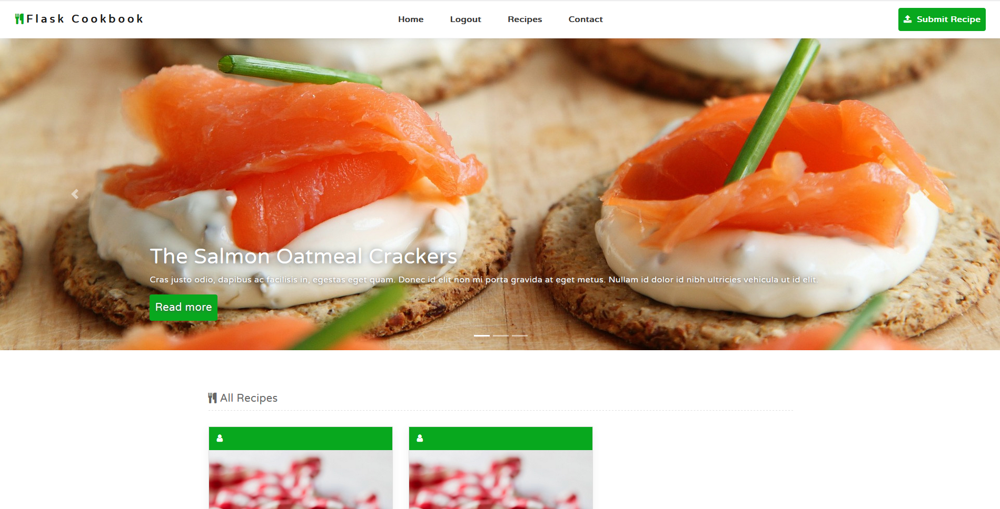
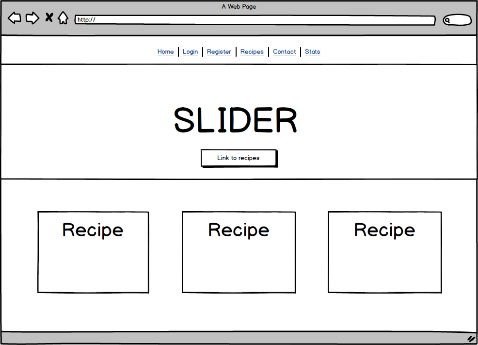
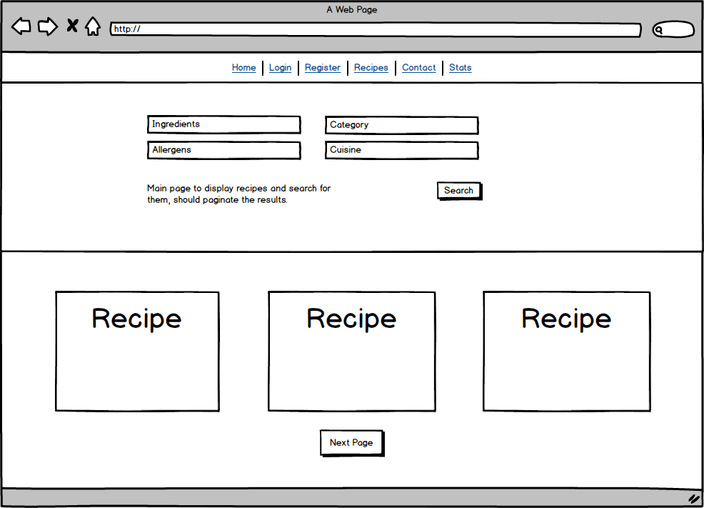
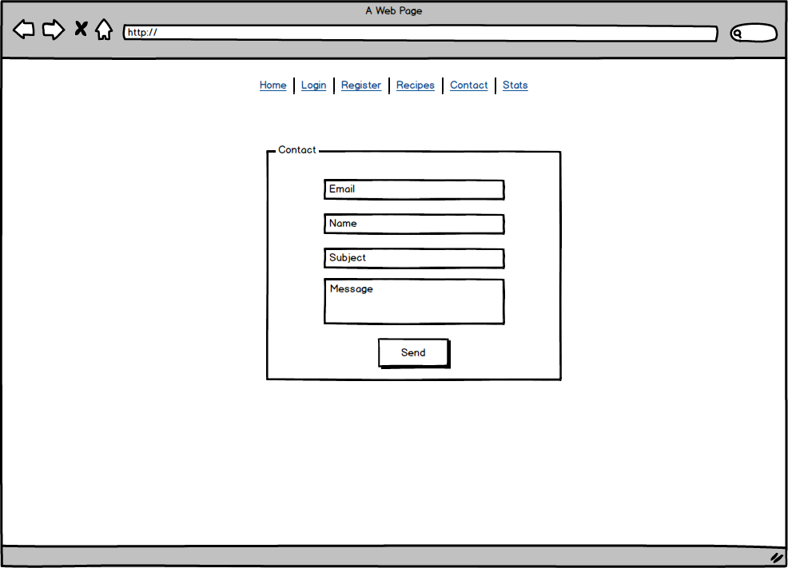
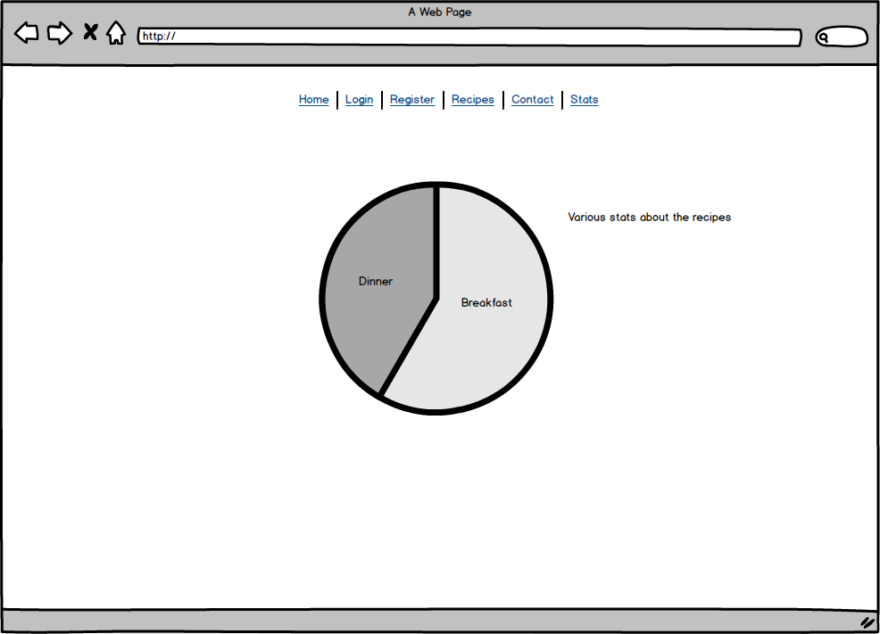
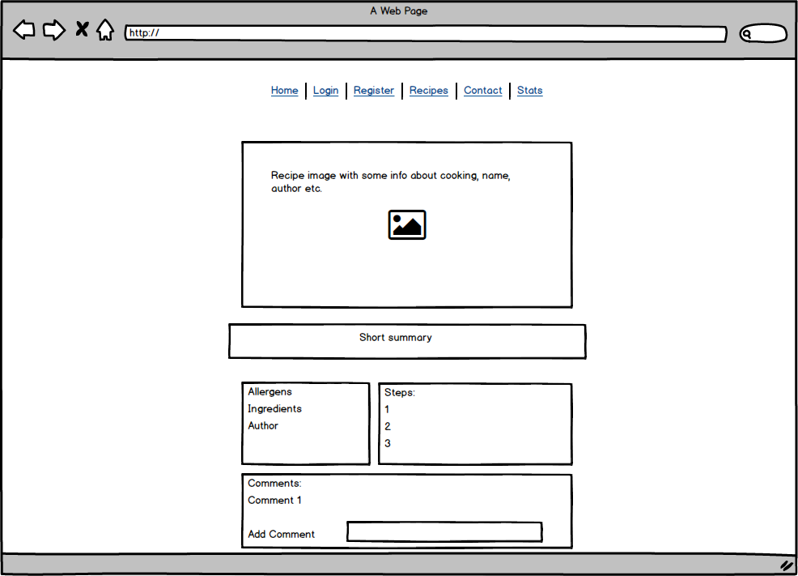

<!-- TABLE OF CONTENTS -->
## Table of Contents

* [About the Project](#about-the-project)
* [Built With](#built-with)
* [Getting Started](#getting-started)
* [Prerequisites](#prerequisites)
* [Usage](#usage)


<!-- ABOUT THE PROJECT -->
## Flask Cookbook



This is my project for Code Institute, a web application that let's you create, browse and edit recipes. I have also added user registration and rich CSS and Javascript visual enchancments.  

You can use my app online under this link [https://flask-cookbook-code.herokuapp.com/index](Heroku FlaskCookbook), registration happens instantly since it's only for the project.

### Planning

I had an idea of what I wanted the website to look like, and based on project specification what pages should be included:






Planning the DB was a bigger headache, I had to figure out a way for allergens and ingredients to be included within many recipes while linking to the same row in database, so I made many to many relationship with association tables:

### Built With
All the bigger frameworks I have used, rest is in the requirements.txt
* [Bootstrap](https://getbootstrap.com)
* [Flask](https://palletsprojects.com/p/flask/)
* [Flask-Migrate](https://flask-migrate.readthedocs.io/en/latest/)
* [Flask-Login](https://flask-login.readthedocs.io/en/latest/)
* [SQLAlchemy](https://www.sqlalchemy.org/)
* [gunicorn](https://gunicorn.org/)
* [WTForms](https://wtforms.readthedocs.io/en/stable/)
* [JQuery](https://jquery.com)


<!-- GETTING STARTED -->
## Getting Started

Clone the repository onto you machine, make sure you have python and pip installed (pip comes with python3, if you have python2 you have to install it manually.)
Preferably install virtualenv too so that you can keep your dependecies separated.
Run ``` pip install -r requirements.txt ```
### Prerequisites

python
pip

## Usage

This project is made for Code Institute course, it could be developed further some time in the future.


